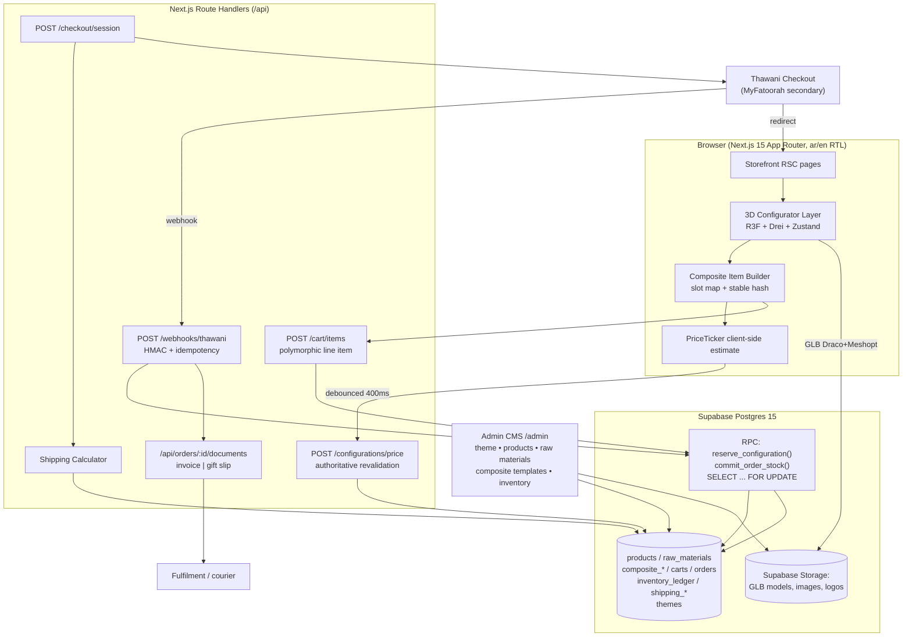

# Context

`mnx17/website-building-workflow` currently contains only a Vite + React scaffold (`src/App.jsx`, `index.html`, `scripts/one-command-build.mjs`). There is no commerce code, no schema, no 3D. This plan specifies a greenfield build of a headless commerce platform for an Omani sweets retailer selling (a) a 4-slot customizable box and (b) a 6–8 ring-slot bouquet, both assembled in an interactive 3D configurator, with Thawani payments, weight-based shipping, price-hiding gift orders, and a theming-ready admin CMS.

Three fixed inputs are amended, with reasons, in §1.3.

---

# 1. Architecture & Stack

## 1.1 Final Stack Table

| Layer | Choice | Version | Reason (tied to requirement) |
|---|---|---|---|
| Frontend | Next.js App Router | 15.x (React 19) | RSC renders catalogue/product pages server-side for SEO; Route Handlers host the commerce API in the same deploy — no separate backend service to operate. |
| 3D runtime | three.js | 0.170.x | Pinned: R3F/Drei break across three minor versions. |
| 3D React binding | @react-three/fiber | 9.x | React 19-compatible; declarative slot graph maps 1:1 to `composite_slots` rows. |
| 3D helpers | @react-three/drei | 9.x | `useGLTF`, `Bounds`, `Html`, `PerformanceMonitor` — the last drives mobile LOD downgrade. |
| 3D state | Zustand 5 + `immer` | 5.x | Store lives outside React tree so `useFrame` reads slot state without re-render; `subscribeWithSelector` drives the debounced price sync. |
| Commerce API | Next.js Route Handlers + `postgres.js` | 3.4.x | Composite BOM logic is bespoke; a framework's variant model is a liability here (see §1.3). |
| DB | Supabase Postgres | 15+ | RLS for admin roles, Storage for models/images, `pg_cron` for reservation expiry. |
| DB access | `postgres.js` via Supavisor transaction pooler | — | Serverless-safe pooling; raw SQL for `FOR UPDATE` locking that PostgREST cannot express. |
| Validation | Zod | 3.23.x | One schema shared by configurator, cart API, and webhook parsing. |
| Money | `dinero.js` v2 with a 3-decimal OMR currency | 2.0.0-alpha | Integer baisa arithmetic; no float rounding drift. |
| Payments | Thawani Checkout (primary), MyFatoorah (secondary) | v1 API | See §1.3 — Stripe is not viable for an Omani merchant. |
| i18n | `next-intl` | 3.x | `[locale]` segment routing, `dir="rtl"` at layout level, ICU plurals for Arabic's six forms. |
| PDF | `@react-pdf/renderer` in a Node runtime route | 4.x | Two templates from one component tree: priced invoice vs. price-free gift packing slip. |
| Admin | Same Next.js app, `/[locale]/admin`, Supabase Auth | — | No second deploy; RLS enforces roles even if a UI guard is bypassed. |
| E2E | Playwright | 1.48+ | Full gift-checkout flow incl. RTL rendering assertions. |
| Hosting | Vercel (storefront) + Supabase | — | Webhook routes pinned `export const runtime = 'nodejs'` for crypto signature verification. |

## 1.2 Architecture Diagram



## 1.3 Key Decisions & Rationale

**Custom Route Handlers, not Medusa.** Medusa binds inventory to `variant_id` at the line-item level. A 4-slot box is a runtime bill-of-materials that decrements four *different* `raw_materials` rows atomically, with per-slot category rules. Modelling that in Medusa means a custom module that bypasses its inventory module anyway — you inherit the migration surface without the benefit. Custom handlers over `postgres.js` put the locking logic where it belongs, in one RPC. Cost: you build tax, discounts, and admin auth yourself; scoped small in v1 (single VAT rate, no B2B tiers, no subscriptions).

**Thawani primary, MyFatoorah secondary — not Stripe.** Stripe does not onboard merchants domiciled in Oman (**Likely**; confirm during merchant onboarding). Apple Pay/Google Pay reach the customer through Thawani's hosted checkout or an OmanNet/Amwal acquirer, not through a Stripe account the client cannot open. MyFatoorah is the realistic GCC fallback with real Omani acquiring. Design the payment layer behind a `PaymentProvider` interface (`createSession`, `verifyWebhook`, `refund`) so the secondary is a 200-line adapter.

**OMR three decimals: integers only, one rounding boundary.** All money is stored and computed as **integer baisa** (`bigint`, 1 OMR = 1000 baisa). Thawani's API takes baisa integers natively — no conversion. Floats never touch money. Gateways that require amounts in multiples of 10 baisa (**Likely** for card rails) get rounding applied *once*, at `POST /checkout/session`, rounding the order grand total half-up to the nearest 10 baisa and writing the delta to `orders.rounding_adjustment_baisa` so the invoice reconciles. Never round per line item — four slot prices rounded individually diverge from the box total.

**RTL from the first commit, not retrofitted.** `app/[locale]/layout.tsx` sets `dir={locale === 'ar' ? 'rtl' : 'ltr'}`. Tailwind logical properties only (`ps-4`/`pe-4`/`ms-`/`me-`/`start-`/`end-`), enforced by an ESLint rule banning `pl-`/`pr-`/`left-`/`right-`. Two consequences people miss: (1) the 3D canvas is **not** mirrored — the box model keeps its world coordinates in both locales, but slot *index-to-screen-position* labels and the drag-source tray flip, so slot ordering must come from `composite_slots.position` (a 3D vector), never from DOM order; (2) numerals stay Western-Arabic (`٠١٢` off) for prices — set `numberingSystem: 'latn'` explicitly in `Intl.NumberFormat`, since Omani price displays conventionally use Latin digits.

---

# 2. Data Model

## 2.1 SQL DDL

```sql
-- PostgreSQL 15+ / Supabase. Money is INTEGER BAISA (1 OMR = 1000 baisa). Weight is GRAMS.
create extension if not exists "pgcrypto";
create extension if not exists "pg_trgm";

create type composite_kind    as enum ('box','bouquet');
create type order_status      as enum ('pending','paid','processing','shipped','delivered','cancelled','refunded');
create type ledger_reason     as enum ('reserve','release','commit','restock','manual_adjust','spoilage');
create type staff_role        as enum ('admin','editor','fulfillment');

create table themes (
  id             uuid primary key default gen_random_uuid(),
  name           text not null,
  logo_url       text,
  primary_color  text not null default '#1F3B2C' check (primary_color  ~ '^#[0-9A-Fa-f]{6}$'),
  secondary_color text not null default '#E8B84B' check (secondary_color ~ '^#[0-9A-Fa-f]{6}$'),
  font_family    text not null default 'Tajawal',
  is_active      boolean not null default false,
  updated_at     timestamptz not null default now()
);
create unique index themes_single_active on themes (is_active) where is_active;

create table staff_users (
  user_id uuid primary key references auth.users(id) on delete cascade,
  role    staff_role not null,
  created_at timestamptz not null default now()
);

create table products (
  id            uuid primary key default gen_random_uuid(),
  slug          text not null unique,
  name_en       text not null,
  name_ar       text not null,
  description_en text, description_ar text,
  image_urls    text[] not null default '{}',
  price_baisa   bigint not null check (price_baisa >= 0),
  weight_grams  integer not null check (weight_grams > 0),
  stock_qty     integer not null default 0 check (stock_qty >= 0),
  is_active     boolean not null default true,
  created_at    timestamptz not null default now()
);
create index products_active_idx on products (is_active) where is_active;

create table raw_materials (
  id             uuid primary key default gen_random_uuid(),
  sku            text not null unique,
  name_en        text not null,
  name_ar        text not null,
  category       text not null,                       -- 'citrus','chocolate','rose', ...
  image_url      text,
  model_url      text,                                -- GLB in Supabase Storage
  color_hex      text check (color_hex ~ '^#[0-9A-Fa-f]{6}$'),
  unit_price_baisa bigint not null check (unit_price_baisa >= 0),
  weight_grams   integer not null check (weight_grams > 0),
  stock_qty      integer not null default 0 check (stock_qty >= 0),
  reserved_qty   integer not null default 0 check (reserved_qty >= 0),
  low_stock_threshold integer not null default 10,
  is_active      boolean not null default true,
  constraint raw_materials_reserved_lte_stock check (reserved_qty <= stock_qty)
);
create index raw_materials_category_idx on raw_materials (category) where is_active;
create index raw_materials_low_stock_idx on raw_materials ((stock_qty - reserved_qty))
  where is_active;

create table composite_products (
  id             uuid primary key default gen_random_uuid(),
  slug           text not null unique,
  kind           composite_kind not null,
  name_en        text not null, name_ar text not null,
  base_price_baisa bigint not null default 0 check (base_price_baisa >= 0),
  base_weight_grams integer not null default 0 check (base_weight_grams >= 0),
  model_url      text not null,
  slot_count     integer not null check (slot_count between 1 and 12),
  min_filled_slots integer not null default 1,
  is_active      boolean not null default true,
  constraint fill_rules_sane check (min_filled_slots <= slot_count),
  constraint kind_slot_count check (
    (kind = 'box'     and slot_count = 4) or
    (kind = 'bouquet' and slot_count between 6 and 8)
  )
);

create table composite_slots (
  id            uuid primary key default gen_random_uuid(),
  composite_product_id uuid not null references composite_products(id) on delete cascade,
  slot_index    integer not null check (slot_index >= 0),
  label_en      text, label_ar text,
  position      jsonb not null,        -- {"x":0,"y":0.12,"z":-0.05,"ry":0.78}
  allowed_categories text[] not null default '{}',   -- empty = any
  max_qty       integer not null default 1 check (max_qty >= 1),
  is_required   boolean not null default false,
  unique (composite_product_id, slot_index)
);

create table composite_configurations (
  id            uuid primary key default gen_random_uuid(),
  composite_product_id uuid not null references composite_products(id) on delete restrict,
  slot_map      jsonb not null,        -- [{"slot_index":0,"raw_material_id":"uuid","qty":1}, ...]
  config_hash   text not null,         -- sha256(composite_product_id + canonical slot_map)
  unit_price_baisa  bigint not null check (unit_price_baisa >= 0),
  total_weight_grams integer not null check (total_weight_grams > 0),
  created_by    uuid references auth.users(id) on delete set null,
  created_at    timestamptz not null default now(),
  constraint slot_map_is_array check (jsonb_typeof(slot_map) = 'array')
);
create unique index composite_configurations_hash_idx
  on composite_configurations (composite_product_id, config_hash);
create index composite_configurations_slotmap_gin on composite_configurations using gin (slot_map);

create table inventory_ledger (           -- append-only
  id             bigserial primary key,
  raw_material_id uuid not null references raw_materials(id) on delete restrict,
  delta_qty      integer not null check (delta_qty <> 0),
  reason         ledger_reason not null,
  cart_id        uuid,
  order_id       uuid,
  actor_user_id  uuid references auth.users(id) on delete set null,
  note           text,
  created_at     timestamptz not null default now()
);
create index inventory_ledger_material_idx on inventory_ledger (raw_material_id, created_at desc);
create index inventory_ledger_order_idx on inventory_ledger (order_id) where order_id is not null;
create rule inventory_ledger_no_update as on update to inventory_ledger do instead nothing;
create rule inventory_ledger_no_delete as on delete to inventory_ledger do instead nothing;

create table carts (
  id           uuid primary key default gen_random_uuid(),
  user_id      uuid references auth.users(id) on delete set null,
  anon_token   text,
  currency     char(3) not null default 'OMR',
  reserved_until timestamptz,
  created_at   timestamptz not null default now(),
  updated_at   timestamptz not null default now()
);
create index carts_anon_idx on carts (anon_token) where anon_token is not null;
create index carts_expiry_idx on carts (reserved_until) where reserved_until is not null;

create table cart_items (                 -- polymorphic: product XOR configuration
  id          uuid primary key default gen_random_uuid(),
  cart_id     uuid not null references carts(id) on delete cascade,
  product_id  uuid references products(id) on delete restrict,
  configuration_id uuid references composite_configurations(id) on delete restrict,
  qty         integer not null check (qty > 0),
  unit_price_baisa bigint not null check (unit_price_baisa >= 0),
  unit_weight_grams integer not null check (unit_weight_grams > 0),
  created_at  timestamptz not null default now(),
  constraint cart_item_exactly_one check (num_nonnulls(product_id, configuration_id) = 1)
);
create unique index cart_items_dedupe_product on cart_items (cart_id, product_id)
  where product_id is not null;
create unique index cart_items_dedupe_config on cart_items (cart_id, configuration_id)
  where configuration_id is not null;

create table shipping_zones (
  id         uuid primary key default gen_random_uuid(),
  code       text not null unique,          -- 'MUSCAT','BATINAH_N','INTL_GCC'
  name_en    text not null, name_ar text not null,
  governorates text[] not null default '{}',
  is_fallback boolean not null default false,
  cod_enabled boolean not null default true
);
create unique index shipping_zones_one_fallback on shipping_zones (is_fallback) where is_fallback;

create table shipping_rates (
  id          uuid primary key default gen_random_uuid(),
  zone_id     uuid not null references shipping_zones(id) on delete cascade,
  min_grams   integer not null check (min_grams >= 0),
  max_grams   integer not null check (max_grams > 0),
  price_baisa bigint not null check (price_baisa >= 0),
  constraint band_valid check (max_grams > min_grams),
  exclude using gist (
    zone_id with =,
    int4range(min_grams, max_grams, '[)') with &&
  )                                            -- no overlapping weight bands per zone
);

create table orders (
  id            uuid primary key default gen_random_uuid(),
  order_number  text not null unique,
  user_id       uuid references auth.users(id) on delete set null,
  status        order_status not null default 'pending',
  currency      char(3) not null default 'OMR',
  subtotal_baisa bigint not null check (subtotal_baisa >= 0),
  shipping_baisa bigint not null default 0 check (shipping_baisa >= 0),
  vat_baisa      bigint not null default 0 check (vat_baisa >= 0),
  rounding_adjustment_baisa bigint not null default 0,
  total_baisa    bigint not null check (total_baisa >= 0),
  total_weight_grams integer not null check (total_weight_grams >= 0),
  shipping_zone_id uuid references shipping_zones(id) on delete set null,
  payment_provider text,
  payment_session_id text,
  payment_reference text,
  placed_at     timestamptz not null default now(),
  paid_at       timestamptz,
  constraint paid_requires_timestamp check (status <> 'paid' or paid_at is not null)
);
create index orders_status_idx on orders (status, placed_at desc);
create unique index orders_payment_session_idx on orders (payment_session_id)
  where payment_session_id is not null;

create table order_items (
  id          uuid primary key default gen_random_uuid(),
  order_id    uuid not null references orders(id) on delete cascade,
  product_id  uuid references products(id) on delete set null,
  configuration_id uuid references composite_configurations(id) on delete set null,
  name_snapshot_en text not null, name_snapshot_ar text not null,
  slot_map_snapshot jsonb,                 -- frozen BOM for fulfilment
  qty         integer not null check (qty > 0),
  unit_price_baisa bigint not null check (unit_price_baisa >= 0),
  unit_weight_grams integer not null check (unit_weight_grams > 0),
  constraint order_item_exactly_one check (num_nonnulls(product_id, configuration_id) = 1)
);
create index order_items_order_idx on order_items (order_id);

create table gift_orders (
  order_id         uuid primary key references orders(id) on delete cascade,
  recipient_name   text not null check (char_length(recipient_name) between 2 and 120),
  recipient_phone  text not null check (recipient_phone ~ '^\+968[79]\d{7}$|^\+\d{8,15}$'),
  delivery_location text not null,
  delivery_geo     jsonb,                 -- {"lat":23.58,"lng":58.38}
  gift_message     text check (char_length(gift_message) <= 280),
  gift_message_status text not null default 'clean'
    check (gift_message_status in ('clean','flagged','rejected')),
  hide_prices      boolean not null default true,
  created_at       timestamptz not null default now()
);

create table webhook_events (
  id            bigserial primary key,
  provider      text not null,
  event_id      text not null,
  signature     text,
  payload       jsonb not null,
  processed_at  timestamptz,
  received_at   timestamptz not null default now(),
  unique (provider, event_id)
);
```

## 2.2 Inventory Deduction Strategy

**Two-phase: reserve on add-to-cart, commit on payment confirmation.** Deducting only at order placement lets a flash sale sell the same last box of rose petals to fifty carts. Deducting at add-to-cart permanently leaks stock into abandoned carts. So:

| Phase | Trigger | Effect | Ledger |
|---|---|---|---|
| Reserve | `POST /cart/items` | `reserved_qty += needed` for every raw material in the slot map; `carts.reserved_until = now() + 30 min` | `reason='reserve'`, `cart_id` set |
| Extend | any cart mutation, checkout session creation | push `reserved_until` forward 30 min | — |
| Release | `pg_cron` sweep every minute over expired carts; also on item removal | `reserved_qty -= …` | `reason='release'` |
| Commit | Thawani webhook → `paid` | `stock_qty -= …`, `reserved_qty -= …` in one transaction | `reason='commit'`, `order_id` set |

Available stock is always `stock_qty - reserved_qty`; never read `stock_qty` alone.

**Race handling.** A Supabase RPC with row locks, ordering lock acquisition by `raw_material_id` to make deadlocks impossible when two carts touch overlapping BOMs in different slot order:

```sql
create or replace function reserve_configuration(p_cart_id uuid, p_config_id uuid, p_qty int)
returns void language plpgsql security definer as $$
declare r record;
begin
  perform 1 from carts where id = p_cart_id for update;   -- serialize per cart

  for r in
    select (e->>'raw_material_id')::uuid as rm_id,
           sum((e->>'qty')::int) * p_qty  as need
    from composite_configurations c,
         lateral jsonb_array_elements(c.slot_map) e
    where c.id = p_config_id
    group by 1
    order by 1                                            -- deterministic lock order
  loop
    perform 1 from raw_materials where id = r.rm_id for update;

    update raw_materials
       set reserved_qty = reserved_qty + r.need
     where id = r.rm_id
       and stock_qty - reserved_qty >= r.need;

    if not found then
      raise exception 'OUT_OF_STOCK:%', r.rm_id using errcode = 'P0001';
    end if;

    insert into inventory_ledger (raw_material_id, delta_qty, reason, cart_id)
    values (r.rm_id, -r.need, 'reserve', p_cart_id);
  end loop;

  update carts set reserved_until = now() + interval '30 minutes', updated_at = now()
   where id = p_cart_id;
end $$;
```

`commit_order_stock(p_order_id)` mirrors this, is **idempotent** (returns early if a `commit` ledger row already exists for the order), and runs inside the webhook handler's transaction. The `raw_materials_reserved_lte_stock` check constraint is the last line of defence — if it ever fires in production, a code path bypassed the RPC.

## 2.3 Indexes & Constraints Summary

| Object | Purpose |
|---|---|
| `cart_item_exactly_one` / `order_item_exactly_one` (`num_nonnulls = 1`) | Enforces the polymorphic item at DB level, not app level. |
| `composite_configurations_hash_idx` | Dedupes identical builds; cart handoff is an upsert on `(composite_product_id, config_hash)`. |
| `shipping_rates` GIST `EXCLUDE` on `int4range` | Makes overlapping weight bands per zone physically impossible — the classic source of wrong shipping quotes. |
| `shipping_zones_one_fallback`, `themes_single_active` | Partial unique indexes guaranteeing exactly one fallback zone / active theme. |
| `orders_payment_session_idx` | Webhook replay maps to exactly one order. |
| `webhook_events (provider, event_id)` unique | Replay attack and duplicate-delivery guard. |
| `inventory_ledger` rules (no update/delete) | Append-only audit; ledger sum must reconcile to `stock_qty`. |
| `raw_materials_low_stock_idx` on `(stock_qty - reserved_qty)` | Powers the admin low-stock dashboard without a seq scan. |
| `kind_slot_count` check | 4 slots for a box, 6–8 for a bouquet, enforced in the schema. |

---

# 3. 3D Configurator

## 3.1 Component Tree

```
<ConfiguratorPage>                      RSC: fetches composite_product + slots + materials
 └─ <ConfiguratorClient>                'use client', hydrates Zustand store
     ├─ <ConfiguratorCanvas>            <Canvas dpr={[1,2]} shadows={!isLowEnd}>
     │   ├─ <Stage/Lighting>            env preset, single shadow-casting light
     │   ├─ <ProductModel>              box or bouquet GLB, Draco+Meshopt
     │   │   ├─ <SlotDropZone idx=0..3>     boxes: invisible collider + highlight ring
     │   │   └─ <BouquetRing radius=r>      bouquets: 6–8 slots on a circle
     │   │        └─ <SlotDropZone idx=0..7>
     │   ├─ <SlotContents>              instanced meshes of placed raw materials
     │   ├─ <GhostPreview>              semi-transparent model following pointer
     │   └─ <PerformanceMonitor>        drei; downgrades dpr/LOD on sustained <40fps
     ├─ <MaterialTray>                  DOM list, dir-aware, drag source + tap source
     ├─ <PriceTicker>                   optimistic total, server-confirmed badge
     └─ <AddToCartBar>                  disabled until min_filled_slots satisfied
```

## 3.2 R3F Component Skeleton (TypeScript, strict)

```tsx
'use client';
import { useRef, useMemo } from 'react';
import { useThree, type ThreeEvent } from '@react-three/fiber';
import { useGLTF } from '@react-three/drei';
import type { Mesh } from 'three';
import { useConfigurator } from '@/lib/configurator/store';
import type { Slot } from '@/lib/configurator/types';

interface SlotDropZoneProps {
  slot: Slot;                       // from composite_slots
  radius?: number;
}

export function SlotDropZone({ slot, radius = 0.06 }: SlotDropZoneProps): JSX.Element {
  const ref = useRef<Mesh>(null);
  const { invalidate } = useThree();

  const dragging   = useConfigurator((s) => s.dragging);
  const occupant   = useConfigurator((s) => s.slotMap[slot.slot_index] ?? null);
  const place      = useConfigurator((s) => s.placeInSlot);
  const setHovered = useConfigurator((s) => s.setHoveredSlot);

  const accepts = useMemo<boolean>(() => {
    if (!dragging) return false;
    if (occupant && occupant.qty >= slot.max_qty) return false;
    return slot.allowed_categories.length === 0
        || slot.allowed_categories.includes(dragging.category);
  }, [dragging, occupant, slot]);

  const onPointerOver = (e: ThreeEvent<PointerEvent>): void => {
    e.stopPropagation();
    setHovered(slot.slot_index, accepts ? 'valid' : 'invalid');
    invalidate();                                   // frameloop="demand"
  };

  const onPointerUp = (e: ThreeEvent<PointerEvent>): void => {
    e.stopPropagation();
    if (!dragging) return;
    if (!accepts) { useConfigurator.getState().rejectDrop(slot.slot_index); return; }
    place(slot.slot_index, dragging.rawMaterialId); // store also debounces server price sync
  };

  return (
    <mesh
      ref={ref}
      position={[slot.position.x, slot.position.y, slot.position.z]}
      rotation-y={slot.position.ry ?? 0}
      onPointerOver={onPointerOver}
      onPointerOut={() => setHovered(null, null)}
      onPointerUp={onPointerUp}
      onClick={onPointerUp}                          {/* tap-to-add parity */}
    >
      <cylinderGeometry args={[radius, radius, 0.02, 16]} />
      <meshBasicMaterial
        transparent
        opacity={dragging ? (accepts ? 0.35 : 0.15) : 0}
        color={accepts ? '#3FBF7F' : '#D9534F'}
      />
    </mesh>
  );
}

useGLTF.preload('/models/box-4slot.draco.glb');
```

## 3.3 Interaction & Pricing Logic

**Models.** One GLB per composite shell + one per raw material. `gltf-transform optimize --compress draco --texture-compress webp`, textures ≤ 1024², target **< 500 KB** per model, hard-fail CI over 700 KB. Two LODs: full mesh desktop, decimated (~40% triangles, no shadows, `dpr=1`) when `navigator.hardwareConcurrency <= 4` or drei's `PerformanceMonitor` reports sustained < 40 fps. `frameloop="demand"` — the canvas is static between interactions, which is what keeps a low-end Android from cooking its battery.

**Interaction.** Both input modes, always: pointer drag from the DOM tray (raycast against `SlotDropZone` colliders) and tap-material-then-tap-slot on touch. Snapping is not physics — dropping anywhere within a slot's collider hard-sets the item to `composite_slots.position`. Feedback: valid slots pulse green, invalid pulse red, `<GhostPreview>` follows the pointer at 0.4 opacity, an invalid drop plays a 120 ms shake + `navigator.vibrate(20)`. Slot ordering derives from `position`, never DOM order, so RTL does not scramble it.

**Pricing.** Client computes optimistically: `base_price_baisa + Σ(unit_price_baisa × qty)` in integer baisa. On every change, a 400 ms debounced `POST /api/configurations/price` returns the authoritative price, weight, and per-material availability. The client shows the optimistic number immediately with a subtle "syncing" state; a mismatch replaces it and toasts. **The server total is the only one that reaches the cart** — `POST /cart/items` recomputes from `raw_materials` and rejects a client-supplied price outright.

## 3.4 Cart Handoff Payload

```json
{
  "composite_product_id": "6b1f...-box",
  "slot_map": [
    { "slot_index": 0, "raw_material_id": "a11c...", "qty": 1 },
    { "slot_index": 1, "raw_material_id": "a11c...", "qty": 1 },
    { "slot_index": 2, "raw_material_id": "77de...", "qty": 1 },
    { "slot_index": 3, "raw_material_id": "9f02...", "qty": 1 }
  ],
  "config_hash": "sha256:1f3c9a...",
  "client_estimate": { "unit_price_baisa": 8750, "total_weight_grams": 640 },
  "qty": 1,
  "locale": "ar"
}
```

`config_hash = sha256(composite_product_id + JSON.stringify(slot_map sorted by slot_index, keys sorted))`. Server recomputes the hash, rejects on mismatch, upserts `composite_configurations` on `(composite_product_id, config_hash)`, then calls `reserve_configuration()`. Identical builds across users share one configuration row; two identical boxes in one cart become `qty = 2` via `cart_items_dedupe_config`.

---

# 4. Admin CMS

## 4.1 Routes & Features

| Route | Feature | Min role |
|---|---|---|
| `/[locale]/admin/theme` | Logo upload → Supabase Storage `branding/`; primary/secondary colour pickers; font select; live preview | admin |
| `/[locale]/admin/products` | Standard product CRUD, multi-image upload, bilingual name/description, price (baisa input, OMR display), weight | editor |
| `/[locale]/admin/materials` | Raw material CRUD: SKU, category, unit price, weight, stock, GLB upload, colour swatch | editor |
| `/[locale]/admin/composites` | Template builder: kind, slot count, per-slot `position` (3D picker writing the JSONB vector), `allowed_categories`, `min_filled_slots` | admin |
| `/[locale]/admin/inventory` | Low-stock table (`stock_qty - reserved_qty < threshold`), ledger view, manual adjustment writing `reason='manual_adjust'` with actor + note | editor |
| `/[locale]/admin/orders` | Order list, state transitions, invoice/gift-slip PDF download, gift flag badge | fulfillment |

Manual stock adjustments never `UPDATE stock_qty` directly from the UI — they call an RPC that writes the ledger row and the stock change in one transaction, so the ledger always reconciles.

## 4.2 RLS Policies

```sql
alter table products                 enable row level security;
alter table raw_materials            enable row level security;
alter table composite_products       enable row level security;
alter table composite_slots          enable row level security;
alter table orders                   enable row level security;
alter table gift_orders              enable row level security;
alter table inventory_ledger         enable row level security;
alter table themes                   enable row level security;

create or replace function has_role(roles staff_role[])
returns boolean language sql stable security definer as $$
  select exists (select 1 from staff_users s
                  where s.user_id = auth.uid() and s.role = any(roles));
$$;

-- Public catalogue read
create policy products_public_read on products
  for select using (is_active);
create policy materials_public_read on raw_materials
  for select using (is_active);
create policy composites_public_read on composite_products
  for select using (is_active);
create policy slots_public_read on composite_slots
  for select using (true);
create policy theme_public_read on themes
  for select using (is_active);

-- Staff writes
create policy products_write on products
  for all using (has_role('{admin,editor}')) with check (has_role('{admin,editor}'));
create policy materials_write on raw_materials
  for all using (has_role('{admin,editor}')) with check (has_role('{admin,editor}'));
create policy composites_write on composite_products
  for all using (has_role('{admin}')) with check (has_role('{admin}'));
create policy theme_write on themes
  for all using (has_role('{admin}')) with check (has_role('{admin}'));

-- Orders: own orders, or any staff role
create policy orders_read on orders
  for select using (user_id = auth.uid() or has_role('{admin,editor,fulfillment}'));
create policy orders_staff_update on orders
  for update using (has_role('{admin,fulfillment}')) with check (has_role('{admin,fulfillment}'));
create policy gift_orders_read on gift_orders
  for select using (
    has_role('{admin,fulfillment}')
    or exists (select 1 from orders o where o.id = order_id and o.user_id = auth.uid())
  );

-- Ledger: staff read, inserts only via SECURITY DEFINER RPCs
create policy ledger_read on inventory_ledger
  for select using (has_role('{admin,editor,fulfillment}'));
```

The service-role key stays server-side in Route Handlers only. `carts`/`cart_items` are never exposed to PostgREST — all cart mutation goes through Route Handlers so pricing cannot be forged.

## 4.3 Theme System

The active `themes` row is fetched in the root layout (RSC, `revalidate: 60`) and emitted as CSS custom properties on `<html>` (`--brand-primary`, `--brand-secondary`, `--brand-font`), consumed by Tailwind via `theme.extend.colors.brand.primary = 'var(--brand-primary)'`. Zero client JS, no flash of unthemed content. Arabic uses **Tajawal** or **IBM Plex Sans Arabic** via `next/font/google` with `subsets: ['arabic','latin']`; the admin font picker is restricted to a whitelist that has real Arabic glyph coverage — most Latin display fonts silently fall back and wreck the Arabic UI. `themes_single_active` means switching theme is a two-statement transaction, not a race.

---

# 5. Checkout, Payments, Shipping

## 5.1 Thawani Integration Flow

```mermaid
sequenceDiagram
  participant C as Customer
  participant N as Next.js Route Handler
  participant T as Thawani API
  participant D as Postgres
  C->>N: POST /api/checkout/session (cart_id, address, gift?)
  N->>D: recompute totals, VAT, shipping; round total to 10-baisa; INSERT order (pending)
  N->>T: POST /checkout/v1/session (client_reference_id=order_id, products[] in baisa)
  T-->>N: session_id + payment_url
  N->>D: UPDATE orders SET payment_session_id
  N-->>C: 303 redirect to payment_url
  C->>T: pays (card / Apple Pay via Thawani)
  T-->>N: POST /api/webhooks/thawani (HMAC-signed)
  N->>D: INSERT webhook_events (unique provider,event_id) -- replay guard
  N->>D: BEGIN; orders -> paid; commit_order_stock(order_id); COMMIT
  T-->>C: redirect success_url
  C->>N: GET /checkout/success -- polls order status, never trusts the redirect
```

Rules: line items are sent in **baisa integers** (`unit_amount`), matching the order total exactly. `client_reference_id = order_id`. Webhook handler runs `export const runtime = 'nodejs'`, verifies the HMAC with `crypto.timingSafeEqual` against the raw body (read via `await req.text()` — never the parsed JSON), rejects events older than 5 minutes, and inserts into `webhook_events` **first**; a unique-violation short-circuits to `200 OK` as the idempotency guard. Order transition to `paid` and `commit_order_stock` share one transaction. The browser redirect back is treated as a hint only — the success page polls order status, because a user can hit `success_url` manually. `MyFatoorah` implements the same `PaymentProvider` interface; COD skips session creation and enters `processing` with stock committed at confirmation call.

## 5.2 Shipping Calculator

```ts
import postgres from 'postgres';

export interface ShippableItem {
  unitWeightGrams: number;
  qty: number;
}

export interface ShippingQuote {
  zoneCode: string;
  priceBaisa: bigint;
  totalWeightGrams: number;
  usedFallback: boolean;
}

/** Composite weight = base shell + Σ(raw material weights) — precomputed into
 *  composite_configurations.total_weight_grams, so this stays pure arithmetic. */
export function aggregateWeight(items: readonly ShippableItem[]): number {
  return items.reduce((g, i) => g + i.unitWeightGrams * i.qty, 0);
}

export async function quoteShipping(
  sql: postgres.Sql,
  items: readonly ShippableItem[],
  governorate: string,
): Promise<ShippingQuote> {
  const totalWeightGrams = aggregateWeight(items);
  if (totalWeightGrams <= 0) throw new Error('EMPTY_CART');

  const [row] = await sql<{ code: string; price_baisa: string; is_fallback: boolean }[]>`
    with zone as (
      select id, code, is_fallback from shipping_zones
       where ${governorate} = any(governorates)
       union all
      select id, code, is_fallback from shipping_zones where is_fallback
       order by is_fallback asc   -- exact zone wins over fallback
       limit 1
    )
    select z.code, r.price_baisa, z.is_fallback
      from zone z
      join shipping_rates r on r.zone_id = z.id
     where ${totalWeightGrams} >= r.min_grams and ${totalWeightGrams} < r.max_grams
     limit 1`;

  if (!row) throw new Error(`NO_RATE_BAND:${governorate}:${totalWeightGrams}`);

  return {
    zoneCode: row.code,
    priceBaisa: BigInt(row.price_baisa),
    totalWeightGrams,
    usedFallback: row.is_fallback,
  };
}
```

Every zone must carry a band reaching `max_grams = 2147483647` so heavy carts never 500; seeding validates that at migration time. Unknown governorate → the single `is_fallback` zone, and the quote is surfaced to the customer as "contact us to confirm" when `usedFallback` is true and the zone is international.

## 5.3 Order State Machine

| From | To | Guard |
|---|---|---|
| `pending` | `paid` | Verified webhook + `commit_order_stock` succeeded in the same tx |
| `pending` | `cancelled` | 24 h unpaid sweep, or customer cancel; releases reservations |
| `paid` | `processing` | Fulfilment staff accepts; freezes `slot_map_snapshot` |
| `processing` | `shipped` | Tracking reference required |
| `shipped` | `delivered` | Courier confirmation or staff mark |
| `paid`/`processing` | `refunded` | Provider refund succeeds; ledger `restock` rows written |
| any | `delivered` (skipping) | **Forbidden** — enforced by a `BEFORE UPDATE` trigger raising on illegal pairs |

Transitions live in one `assert_transition(old, new)` trigger function, not in application code, so an admin UI bug cannot corrupt state.

---

# 6. Gifting Flow

## 6.1 Frontend Behavior

A single checkout toggle ("This is a gift 🎁") conditionally renders recipient name, recipient phone (`+968` mask, validated against the DB regex), delivery location with a map pin writing `delivery_geo`, and a 280-character gift message with a live counter — counted in **grapheme clusters** via `Intl.Segmenter`, since Arabic combining marks make `String.length` lie. `hide_prices` defaults **true** and is shown as an explicit, editable checkbox: some senders want the recipient to see value. Buyer-facing screens always show full prices; the toggle only governs recipient-facing documents.

## 6.2 Backend & Fulfilment Rules

`gift_orders.hide_prices = true` drives exactly three behaviours:

1. **Documents.** `/api/orders/:id/documents?type=packing_slip` renders the `GiftPackingSlip` React-PDF template — items, quantities, slot contents, gift message, recipient block, **no unit prices, no totals, no VAT line**. The priced `Invoice` template is served only to the buyer's authenticated session or a staff role; the route asserts this before rendering, so a leaked slip URL cannot reveal prices.
2. **Fulfilment payload.** `gift_message`, `recipient_*`, and a `gift: true` flag are attached to the courier/fulfilment JSON; picking staff see a "gift wrap" instruction line.
3. **Email.** The recipient notification uses a price-free template. The buyer's confirmation is always fully priced and goes to the buyer's address only — the recipient's phone/email is never used for financial correspondence.

## 6.3 Edge Cases

| Case | Handling |
|---|---|
| Gift + COD | Blocked. Asking a recipient to pay is a support disaster. Toggle disables COD and shows the reason; `shipping_zones.cod_enabled` still governs non-gift COD. |
| Gift + international | Customs declarations legally require a declared value — the price-free slip cannot be the customs form. Generate a separate customs declaration attached to the *outer* waybill, and warn the buyer at checkout that customs paperwork will show value. |
| Message length | 280 graphemes, enforced client-side and by the `char_length` check constraint. |
| Profanity / abuse | `gift_message_status` with a hook: async job screens Arabic + English wordlists, sets `flagged` for staff review before printing, `rejected` blocks printing and notifies the buyer. Never silently edit the message. |
| Recipient phone = buyer phone | Allowed, warned — it's usually a self-gift or a typo. |
| RTL message on the slip | React-PDF needs an explicit Arabic font registration + `direction: 'rtl'`; without it Arabic renders as disconnected reversed glyphs. Snapshot-test this. |

---

# 7. Delivery Roadmap

| Phase | Duration | Deliverables | Exit Criteria | Depends on |
|---|---|---|---|---|
| **P1 — Data model + backend** | 3 weeks | Full DDL + migrations, RLS, `reserve_configuration` / `commit_order_stock` / `assert_transition`, seed data, cart & configuration Route Handlers, Zod contracts, `pg_cron` reservation sweep | 50 concurrent `reserve_configuration` calls on 1 unit of stock → exactly 1 success, 49 `OUT_OF_STOCK`, ledger reconciles to `stock_qty` | — |
| **P2 — 3D configurator + cart** | 4 weeks | GLB pipeline + budget CI check, `ConfiguratorCanvas` tree, drag + tap parity, snapping, ghost/reject feedback, PriceTicker with debounced authoritative sync, cart handoff with `config_hash`, ar/en RTL storefront shell | Box and bouquet both configurable and add-to-cart-able on a mid-range Android at ≥ 30 fps; server price matches client estimate in 100/100 fuzz runs | P1 |
| **P3 — Checkout, payments, shipping, gifting** | 3 weeks | Thawani session + webhook + idempotency, `PaymentProvider` interface + MyFatoorah adapter, shipping calculator + zone/band seeding, order state machine, gift toggle + both PDF templates + emails | Replayed webhook commits stock exactly once; end-to-end Thawani sandbox payment reaches `paid`; gift slip contains zero price strings (asserted in test) | P1, P2 |
| **P4 — Admin CMS, theming, hardening** | 3 weeks | Admin routes, role model, composite template builder with 3D slot picker, inventory dashboard + audit trail, theme system, Playwright E2E, VAT/rounding audit, load test | Staff can launch a new composite template and see it live without a deploy; full Playwright gift-checkout suite green in ar and en | P1–P3 |

**Total ≈ 13 weeks** for a 2 engineers + 1 3D artist team. The 3D artist works in parallel from week 1; if models slip, P2 slips — that is the schedule's critical dependency, not the code.

---

# 8. Risks & NFRs

## 8.1 Risk Register

| Risk | Likelihood | Impact | Mitigation |
|---|---|---|---|
| Stripe unavailable to an Omani entity, killing the "Apple Pay via Stripe" plan | High | Med | `PaymentProvider` abstraction from day 1; MyFatoorah as the real secondary; validate merchant onboarding in week 1, before P3 |
| 3D unusable on low-end Android (< 3 GB RAM) | High | High | `frameloop="demand"`, LOD downgrade via `PerformanceMonitor`, ≤ 500 KB models, and a **non-3D fallback grid configurator** behind a feature flag — write it in P2, not as an emergency in P4 |
| Webhook replay / forged webhook | Med | High | HMAC over the raw body with `timingSafeEqual`, 5-minute timestamp window, `webhook_events` unique constraint, order-status guard |
| Inventory oversell during a flash sale | Med | High | Reserve-on-add with `FOR UPDATE`, deterministic lock ordering, `reserved_qty <= stock_qty` check constraint as backstop |
| OMR rounding drift between cart, gateway, and invoice | Med | Med | Integer baisa everywhere, rounding applied once at session creation, delta persisted in `rounding_adjustment_baisa`, property-based test asserting `subtotal + shipping + vat + rounding = total` |
| Arabic/RTL regressions after launch | Med | Med | Logical-property ESLint rule, Playwright runs the whole suite in both locales, Arabic font registered in React-PDF with snapshot tests |
| Model asset bloat over time | Med | Med | CI fails a PR whose GLB exceeds 700 KB |
| VAT rule change / exempt items | Low | Med | VAT rate stored per-product-category in config, not hardcoded; `vat_baisa` persisted per order for historical accuracy |
| Abandoned-cart reservations starving stock | Med | Med | 30-minute TTL + `pg_cron` release sweep + admin visibility into `reserved_qty` |

## 8.2 Testing Strategy

- **Unit (Vitest).** Pricing in integer baisa; `aggregateWeight`; 10-baisa rounding; `config_hash` canonicalization (key order and slot order must not change the hash); grapheme-accurate message length; VAT computation.
- **Integration (Vitest + Testcontainers Postgres, real schema).** `reserve_configuration` under 50 concurrent workers on 1 unit; ledger-to-stock reconciliation invariant; webhook replay committing stock once; illegal state transitions rejected by the trigger; shipping band lookup incl. the fallback zone and the unbounded top band.
- **E2E (Playwright, ar + en).** Configure a 4-slot box → verify price → add to cart → gift toggle with recipient + Arabic message → Thawani sandbox payment → order reaches `paid` → download packing slip → **assert the PDF text contains no digit-grouped price and no "OMR"/"ر.ع."** → assert `dir="rtl"` and that the slot tray flips while the 3D model does not.
- **Performance.** Lighthouse budget on the configurator route; a scripted mid-range Android fps check in P2's exit criteria.

## 8.3 Compliance Checklist

| Item | Requirement | Implementation |
|---|---|---|
| VAT | Oman 5% | Per-category rate in config; `vat_baisa` persisted per order; tax invoice shows VAT number, VAT amount, and totals in OMR |
| Currency | OMR, 3 decimals | `bigint` baisa storage; `Intl.NumberFormat('ar-OM'\|'en-OM', {currency:'OMR', minimumFractionDigits:3, numberingSystem:'latn'})` |
| PCI | Minimize scope (SAQ-A) | Hosted Thawani/MyFatoorah checkout only; no card data touches the app; no card fields in any DOM |
| RTL / Arabic | Full parity | `dir` at layout level, logical properties enforced by lint, Arabic-capable fonts, bilingual content columns on every catalogue table, Arabic-registered PDF fonts |
| PDPL (Oman data protection) | Recipient PII | `gift_orders` recipient data readable only by the buyer and staff (RLS above); phone/location not used for marketing; retention policy on delivered orders |
| Audit | Stock traceability | Append-only `inventory_ledger` with actor and reason; UPDATE/DELETE blocked by rules |

## Verification (once built)

1. `npm run test:integration` — concurrency and reconciliation suites must pass against a real Postgres.
2. Apply migrations to a Supabase branch via `mcp__Supabase__apply_migration`; run `mcp__Supabase__get_advisors` for RLS and performance findings; confirm no table with customer data has RLS disabled.
3. Thawani sandbox: complete a payment, then re-POST the identical webhook body 5× and assert exactly one `commit` ledger row per material.
4. `npx playwright test --grep @gift` in both locales; inspect the generated packing-slip PDF for price leakage.
